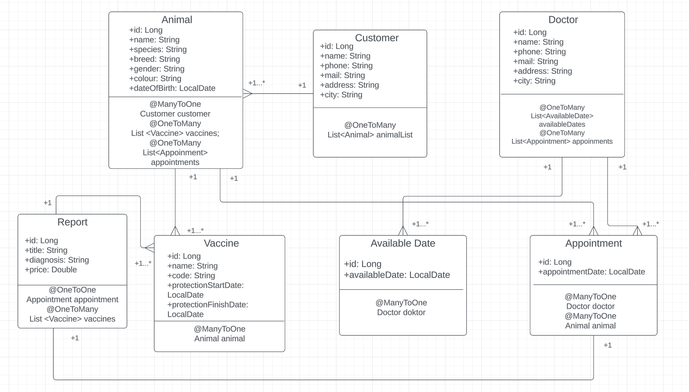

# Veterinary Management System API

## Overview

The Veterinary Management System API is a comprehensive solution for veterinary clinics to efficiently manage their business operations.
This API is designed to be used by veterinary staff and supports a layered architecture.
The system enables veterinary doctors to register, manage working days, register customers and their animals, record vaccinations and reports, and also schedule appointments.

## Layered Architecture

The Veterinary Management System follows a layered architecture, ensuring a modular and scalable design. The layers include:

1. **Presentation Layer**: The user interface or any client interacting with the API.
2. **Application Layer**: The business logic layer that handles the core functionality of the system.
3. **Data Access Layer**: Responsible for interacting with the database to store and retrieve data.

## System Features

### 1. Veterinary Doctor Management

- **Register Doctors**: Add a new doctor to the system with their information.
- **Update Doctors Information**: Modify details of registered doctors.
- **View Doctors**: Retrieve a list of all registered doctors.
- **Delete Doctors**: Remove doctors from the system.

### EndPoints

| HTTP METHOD | ENDPOINT               | DESCRIPTION             |
| ----------- | ---------------------- | ----------------------- |
| **POST**    | `/api/v1/doctors`      | to create a new doctor  |
| **GET**     | `/api/v1/doctors`      | to get all doctors      |
| **GET**     | `/api/v1/doctors/{id}` | to get one doctor by id |
| **PUT**     | `/api/v1/doctors`      | to update the doctor    |
| **DELETE**  | `/api/v1/doctors/{id}` | to delete the doctor    |

### 2. Doctor's Available Days Management

- **Add Available Days**: Record the days doctors are available without specifying time.
- **Update Available Days**: Modify the available days of doctors.
- **View Available Days**: Retrieve a list of available days for each doctor.
- **Delete Available Days**: Remove recorded available days.

### EndPoints

| HTTP METHOD | ENDPOINT                       | DESCRIPTION                     |
| ----------- | ------------------------------ | ------------------------------- |
| **POST**    | `/api/v1/available-dates`      | to create a new available date  |
| **GET**     | `/api/v1/available-dates`      | to get all available dates      |
| **GET**     | `/api/v1/available-dates/{id}` | to get one available date by id |
| **PUT**     | `/api/v1/available-dates`      | to update the available date    |
| **DELETE**  | `/api/v1/available-dates/{id}` | to delete the available date    |

### 3. Animal and Customer Management

- **Register Animals**: Add new animals to the system with details.
- **Update Animal Information**: Modify information about registered animals.
- **View Animals**: Retrieve a list of all registered animals.
- **Delete Animals**: Remove animals from the system.

- **Register Animal Owners(Customer)**: Add new customer to the system with their information.
- **Update Customer Information**: Modify details of registered customers.
- **View Customer**: Retrieve a list of all registered customers.
- **Delete Customers**: Remove customers from the system.

- **Filter Customers by Name**: Create an endpoint to filter customers by name.
- **Filter Animals by Name**: Create an endpoint to filter animals by name.
- **View All Animals of a Customers**: Create an endpoint to view all animals of a specific customer.

### EndPoints

| HTTP METHOD | ENDPOINT                                                                    | DESCRIPTION                        |
| ----------- | --------------------------------------------------------------------------- | ---------------------------------- |
| **POST**    | `/api/v1/animals`                                                           | to create a new animal             |
| **GET**     | `/api/v1/animals`                                                           | to get all animals                 |
| **GET**     | `/api/v1/animals/{id}`                                                      | to get one animal by id            |
| **PUT**     | `/api/v1/animals`                                                           | to update the animal               |
| **DELETE**  | `/api/v1/animals/{id}`                                                      | to delete the animal               |
| **GET**     | `/api/v1/animals?nameLike={animal_name}`                                    | to get the animal by name          |
| **GET**     | `/api/v1/animals/customer-name`                                             | to get the animal by customer name |
| **GET**     | `/api/v1/animals/vaccine-dates?startDate={yyyy-mm-dd}&endDate={yyyy-mm-dd}` | to get the animal by vaccine dates |

###

| HTTP METHOD | ENDPOINT                                     | DESCRIPTION                 |
| ----------- | -------------------------------------------- | --------------------------- |
| **POST**    | `/api/v1/customers`                          | to create a new customer    |
| **GET**     | `/api/v1/customers`                          | to get all customers        |
| **GET**     | `/api/v1/customers/{id}`                     | to get one customer by id   |
| **PUT**     | `/api/v1/customers`                          | to update the customer      |
| **DELETE**  | `/api/v1/customers/{id}`                     | to delete the customer      |
| **GET**     | `/api/v1/customers?nameLike={customer_name}` | to get the customer by name |

### 4. Vaccination Management

- **Register Vaccinations**: Add new vaccination records for animals.
- **Update Vaccination Information**: Modify information about applied vaccinations.
- **View Vaccination Records for an Animal**: Retrieve a list of all vaccination records for a specific animal.
- **Delete Vaccinations**: Remove vaccination records from the system.

- **List Animals with Expiring Vaccinations**: Create an endpoint to list animals with vaccination protection expiration dates in a specified range.

### EndPoints

| HTTP METHOD | ENDPOINT                              | DESCRIPTION                  |
| ----------- | ------------------------------------- | ---------------------------- |
| **POST**    | `/api/v1/vaccines`                    | to create a new vaccine      |
| **GET**     | `/api/v1/vaccines`                    | to get all vaccines          |
| **GET**     | `/api/v1/vaccines/{id}`               | to get one vaccine by id     |
| **GET**     | `/api/v1/vaccines/get-by-animal/{id}` | to get vaccines by animal id |
| **PUT**     | `/api/v1/vaccines`                    | to update the vaccine        |
| **DELETE**  | `/api/v1/vaccines/{id}`               | to delete the vaccine        |

### 5. Appointment Management

- **Create Appointments**: Schedule appointments for animals with date and time.
- **Update Appointment Information**: Modify details of scheduled appointments.
- **View Appointments**: Retrieve a list of all scheduled appointments.
- **Delete Appointments**: Remove appointments from the system.

- **Filter Appointments by Date Range and Doctor**: Create an endpoint to filter appointments by user-entered date range and doctor.
- **Filter Appointments by Date Range and Animal**: Create an endpoint to filter appointments by user-entered date range and animal.

### EndPoints

| HTTP METHOD | ENDPOINT                                                                                                              | DESCRIPTION                        |
| ----------- | --------------------------------------------------------------------------------------------------------------------- | ---------------------------------- |
| **POST**    | `/api/v1/appointments`                                                                                                | to create a new appointment        |
| **GET**     | `/api/v1/appointments`                                                                                                | to get all appointments            |
| **GET**     | `/api/v1/appointments/{id}`                                                                                           | to get one appointment by id       |
| **GET**     | `/api/v1/appointments/available-date-and-doctor?startDate={yyyy-mm-dd}&endDate={yyyy-mm-dd}&doctorName={doctor_name}` | to get appointments by doctor name |
| **GET**     | `/api/v1/appointments/available-date-and-doctor?startDate={yyyy-mm-dd}&endDate={yyyy-mm-dd}&doctorName={animal_name}` | to get appointments by animal name |
| **PUT**     | `/api/v1/appointments`                                                                                                | to update the appointment          |
| **DELETE**  | `/api/v1/appointments/{id}`                                                                                           | to delete the appointment          |

### 6. Reports Management

- **Register Reports**: Add new report for an appointment.
- **Update Report Information**: Modify information about reports.
- **View Reports**: Retrieve a list of all reports.
- **Delete Vaccinations**: Remove reports from the system.

### EndPoints

| HTTP METHOD | ENDPOINT               | DESCRIPTION            |
| ----------- | ---------------------- | ---------------------- |
| **POST**    | `/api/v1/reports`      | to create a new report |
| **GET**     | `/api/v1/reports`      | to get all reports     |
| **PUT**     | `/api/v1/reports`      | to update the report   |
| **DELETE**  | `/api/v1/reports/{id}` | to delete the report   |

You can also access the API Endpoints through the following Postman collection:
https://api.postman.com/collections/31485402-034d6637-60d4-44fa-8774-8311690d0837?access_key=PMAT-01HSB9ETTBJZABT1F5V9YPM1RX

---

### UML Diagram

You can see the UML Diagram below for the application.

